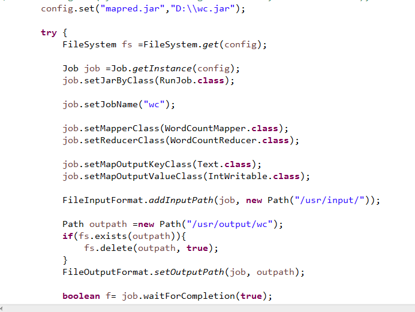

# hadoop介绍
** hadoop ** 是一种分布式的系统基础框架，主要有HDFS和MapReduce这两个模块组成。HDFS主要是对数据的存储，而MapReduce则是对数据的处理。

# hadoop集群的搭建

1.搭建一个hadoop集群至少需要四台电脑，一个namenode和三个datanode。另外可以在此基础上添加zookeeper，我在实验的时候搭建的是HDFS HA集群，使用的虚拟机，集群搭建网上有很多的教程，大家可以在网上参考，这里就不多介绍了。但是大家在搭建集群的过程中，一定要一步步的来，一步步的检查。如果出现了错误，可以通过查看日志的方法，当然，也可以找百度。 
2.在搭建好上面的集群后，配置一下YARN，YARN在hadoop官网上有详细的介绍，配置方法，官网上也很详细。 
3.YARN是一种新的Hadoop资源管理器，它是一个通用的资源管理系统，可为上层应用提供统一的资源管理和调度，它的引入为集群在利用率、资源统一管理和数据共享等方面带来了巨大的好处。 
4.YARN具体的执行流程可以参考hadoop的官网，这里我们不需要过多的了解。 
5.ok，在完成了上面的环境搭建后，启动服务，首先我们可以启动zookeepr.命令：zkServer.sh start，然后启动journalnode，命令：hadoop-daemon.sh start journalnode，然后启动整体启动start-dfs.sh。（注意首次启动过程中，需要格式化namenode，hdfs namenode -format，然后同步文件到另一台namenode上。然后初始化zookeeper hdfs zkfc -formatZK，这些官网的文档中都有详细的介绍),最后就是启动YARN，start-yarn.sh.在备用的resource manage上执行：yarn-daemon.sh start resourcemanager. 

# hadoop的执行
hadoop的执行有三种方式，第一种服务器环境，直接把jar包拷贝到服务器上，然后执行hadoop jar 包名 执行类名(包括打包的名称) 
第二种服务器环境，把jar包放到本地，配置java的jrd到环境中，删除原有的jre。在项目src目录下添加两个修改后的java包，然后在main函数中添加config.set("mapred.jar","jar包所在的路径名");然后在eclipse中执行。当然，我们在eclipse中执行，需要一个hadoop的eclipse插件。自己稍微安装配置一下就好了。 
第三种方法，本地的测试环境，在hadoop目录下的bin目录中添加winutils.exe.在window下配置hadoop的环境变量，配置java的jre到eclipse中，删除原有的jre。并且src中不能有hadoop的配置文件。在main函数中使用config.set("fs.defaultFS","hdfs://服务器地址:端口");config.set("yarn.resourcemanager.hostname",主机名);

## 需要注意的是，在服务器环境中，在eclipse中的项目src里需要添加hadoop配置文件。

# hadoop的WordCount程序
这是一个单词的计数程序，相当于我们java中的Hello World。 

